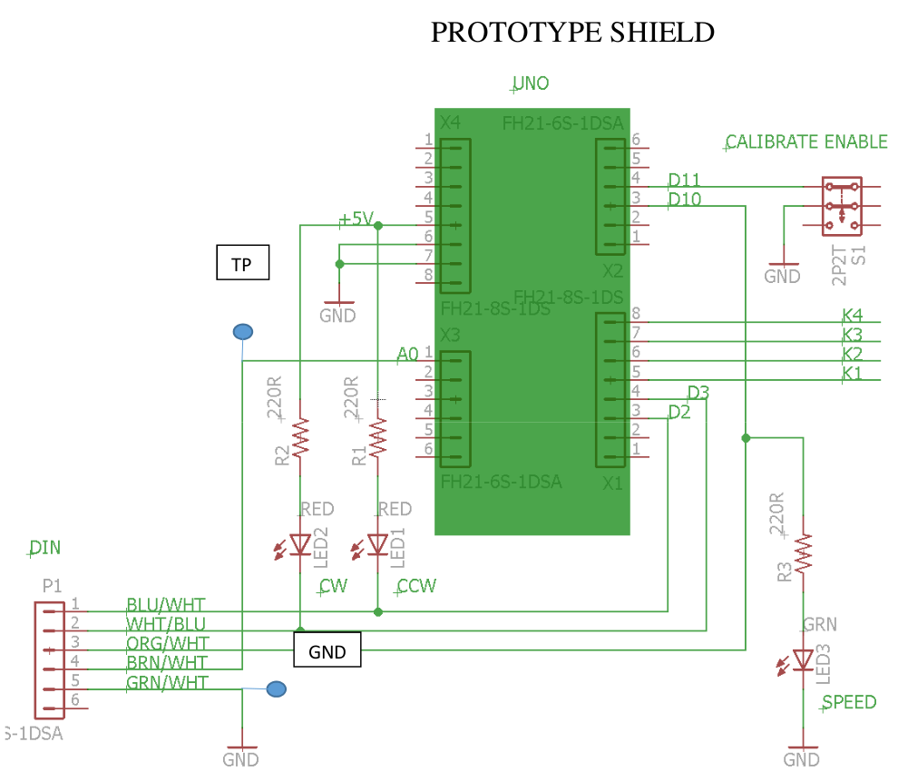

# Yeasu G-2800DXA Rotor remote control

In use at the [Leamington, Utah HF Remote](https://user.xmission.com/~uarc/HFRemote.html) operated by UARC.

Design based on Yeasu G-800 sketch by Glen Popiel, KW5GP. from “[More Arduino Projects for Amateur Radio](http://www.arrl.org/shop/More-Arduino-Projects-for-Ham-Radio/)”, Chapter 18.

Sketch implemented in [Arduino UNO R3](https://store.arduino.cc/usa/arduino-uno-rev3) with prototype shield (for connection to G-2800DXA) and relay shield board.

## SUPPORTED SERIAL PROTOCOL
- **R**	Rotate clockwise
- **L**	Rotate counterclockwise
- **A**	Rotation STOP
- **S**	Rotation STOP
- **Mxxx**	Move to azimuth xxx (000-450) must be 3 digits
- **C**	Request current position.  Reply: +0yyy where yyy = azimuth
- **Kx**	Relay board (has nothing to do with rotator)  x=0-4
  - These are general purpose Form C relay contacts (SPDT) for some future function.
  - **K0** = de-energizes all relays
  -	**K1** = energizes relay 1 (disables other 3)
  -	**K2** = energizes relay 2 (disables other 3)
  - **K3** = energizes relay 3 (disables other 3)
  - **K4** = energizes relay 4 (disables other 3)
- **Xz**	Rotation speed.  (z=1-4).  Default power-up = X4
  - **X1** = Low speed (25% PWM ~ 1.25V)
  - **X2** = Middle speed 1 (50% PWM ~ 2.5V)
  - **X3** = Middle speed 2 (75% PWM ~ 3.75V)
  - **X4** = High speed (100% PWM ~ 5V) 
- **Fx**	Calibration (x=0-5)
  - **F0** = 0 degree calibration
  - **F5** = 450 degree calibration
  - **F?** = Display calibration values
       
## CALIBRATION PROCEDURE:
- 	Enable calibration switch (on prototype board - toward outside of board.
- 	If an 'F' command is sent while disabled, controller replies "Calibration Disabled"
- 	Connect voltmeter to “position” test point on prototype board and ground lug.
- 	Manually Rotate CW to end stop (450 degrees).
- 	Adjust “OUT VOL ADJ” pot on rear of G-2800DXA to 5.00 volts on meter.
- Send F5 command
- 	Manually Rotate CCW to end stop (0 degrees).	Send F0 command
- 	Disable calibration switch (on prototype board - toward middle of board.
- 	Cycle power on Arduino UNO board.

## SYSTEM NOTES

This rotator controller was built for installation at our club’s remote HF station, located in rural
Leamington, Utah, about 2 hours from “civilization”. The HF station is controlled by RCForb. Since
Ron Popiel’s design emulates the Yaesu G-232 controler, the Arduino simply plugs into a USB port, and
the RCForb program is configured to control a Yaesu rotator.

The Yaesu G-2800DXA controller has a remote control DIN connector on the rear. The Rotate “Left”
and “Right” commands are TTL inputs, so they are driven directly from Arduino pins. The “Speed” input
is intended to be an analog input voltage. This is simulated by sending a PWM signal from the Arduino
(25%, 50%, 75% and 100%) which corresponds roughly to 1, 2, 3, and 4 volts to the controller.

The position output from the G-2800DXA is adjustable, and is calibrated to 0V for fully CCW, and 5V
for 450 degrees of rotation. The original Popiel code had a complicated breakdown that calibrated the
output voltage into 90 degree quadrants. The G-2800DXA output is so close to linear, this code was
abandoned as unnecessary. The 0-5V goes directly to the 10 bit A/D in the UNO and is converted to
degrees in the sketch.

A prototype board was purchased at a time when we hadn’t chosen a target rotator for this project. Since
it was available, it was used to clean up the connections to the DIN connector cable, and to add some
indicators, a position test point, and a calibration switch. The drawing on the next page shows how it
interconnects.

A relay shield was also purchased at the beginning of the project, expecting it would be necessary to
interface to whichever rotator controller was chosen. The G-2800DXA did not require it. Code was
added to control these relays (the ‘K’ commands). These commands have NOTHING to do with the
rotator control. It was simply included because it was available. We suspect these may be used in the
future for some feature such as antenna switching.

[Download PDF of this document](Leamington_G-2800DXA_remote_control.pdf)